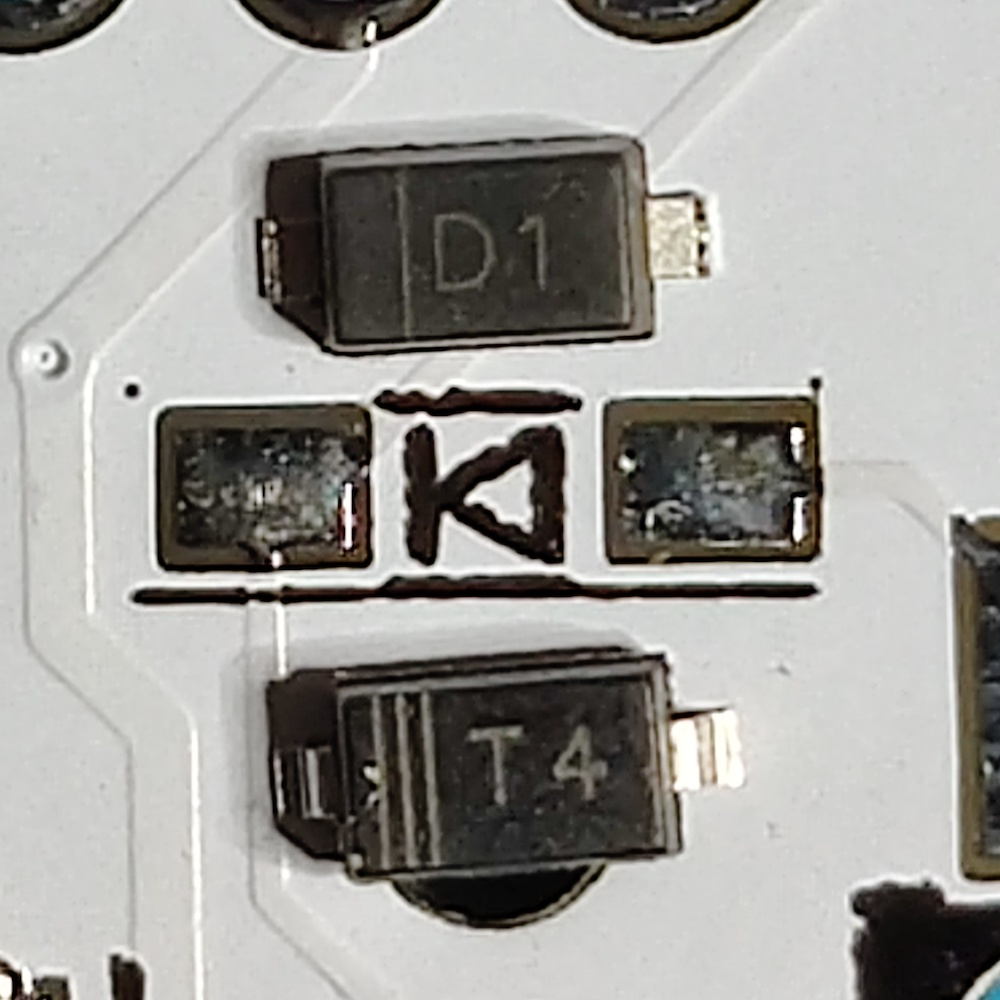

# Build tips

## Table of contents

- [Learn to solder](#learn-to-solder)
- [Basics: diodes](#basics-diodes)
- Socketing is worthwhile if using pro micros
- Simplify soldering headers
- [test that a keycode is pressed](#test-that-a-keycode-is-pressed)

## Learn to solder

## Basics: diodes

### What does a diode do?

A diode prevents current from flowing backwards, basically making the circuit a 'one-way street'.

### How to solder

Most DIY keyboards use diodes. There are two types, through-hole (also abbreviated as THT) and surface mount (also abbreviated as SMD). Through-hole is more common.

Diodes have polarity, meaning that they have a specific direction they must be soldered in to function properly. This polarity is usually also printed on the PCB. The symbol for diodes usually looks like this `▶❙`, a triangle with a bar across the point. The diodes themselves also usually have a stripe printed or etched on them. **The orientation of the lines should match when soldered.**

Diodes are not sensitive to heat.

## Socketing is worthwhile if using pro micros

## Simplify soldering headers

## Test that a keycode is pressed

There are many good websites to use to test keypresses, such as [Keyboard Tester](https://www.keyboardtester.com/tester.html).

Keep in mind that firmwares like QMK sometimes use non-standard/custom keycodes that cannot be detected. It may be worth using a standard keycode at that switch position for testing purposes.
