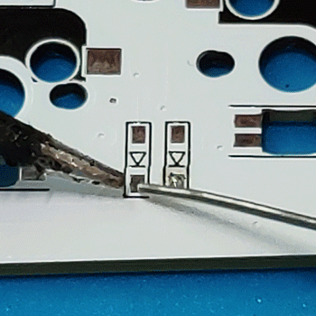
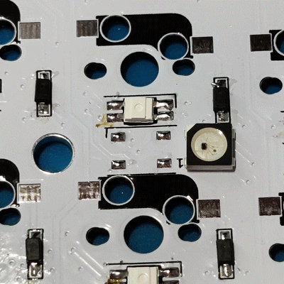
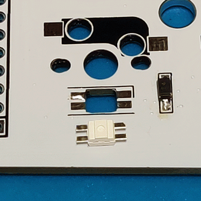
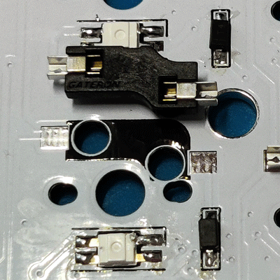
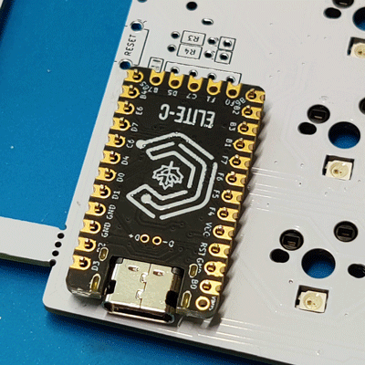
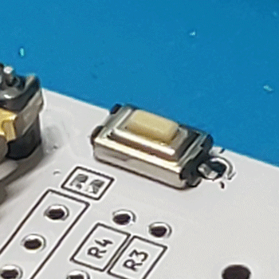
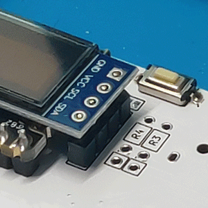
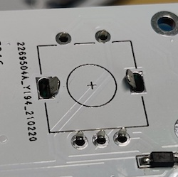

# Sofle RGB 

Available at: https://keyhive.xyz/shop/sofle

## Instructions

1. Solder
   - [diodes](#solder-diodes)
   - [underglow LEDs](#solder-underglow-leds)
   - [per-key RGB LEDs](#solder-per-key-rgb-leds)
   - [hot swap sockets](#solder-hot-swap-sockets)
1. [Flash controller](#flash-controller)
1. [Solder controller](#solder-controller)
1. [Solder the reset button](#Solder-reset-button)
1. [Test the keyboard](#test-the-keyboard)
1. [Solder OLEDs](#solder-oleds)
1. [Solder TRRS jacks](#solder-trrs-jacks)
1. Break PCBs from scaffold
1. [Solder encoders](#solder-encoders)
1. [Install OLED cover](#install-oled-cover)
1. [Install switches](#install-switches)
1. [Install encoder knobs](#install-encoder-knobs)

## Solder diodes

Soldering diodes is relatively straightforward. Refer to [Soldering diodes](../basic/soldering-diodes.md) if you need further guidance.

## Solder underglow LEDs

> ⚠︎ LEDs can be very temperature sensitive. Be _very careful_. Consider setting your soldering to a low temp (about 200 C), using a fine tip, adding flux, and/or using a hot air station.

Tin all the pads with a small bubble of solder, not too much. Place the 5050 LED on top and center. With some light pressure, hold the led in place while you flow the solder bubbles. I use an aluminum screwdriver which also acts as a heat sink to protect the LED from burning out. Test each LED as you go.

## Solder per-key RGB LEDs

> ⚠︎ LEDs can be very temperature sensitive, however this variant with the tabs are much easier to use and less prone to burning out. Still, take care to not allow too much heat to transfer.

Tin one pads with a small amount of solder. Place the LED into the cutout. Hold the LED in place with tweezers, and flow the solder under the tab. Let cool and solidify. Apply a tiny bit of solder to the remaining tabs. Test each LED as you go.

## Solder Kailh hot swap sockets

Refer to [Soldering Kailh hot swap sockets](../basic/soldering-kailh-hot-swap-sockets.md) if you need further guidance.

## Flash controller

Flash the controller (pro micro, Elite C, nice!nano, etc) with the firmware. This ensures that the controller works completely **before** soldering it permanently to the board.

[TODO: Add link to firmware files](#todo)

## Solder controller

Refer to [Soldering the controller](../basic/soldering-the-controller.md) if you need further guidance.

## Solder reset button

Insert or align to holes. Solder in place.

## Test the keyboard

At this point it should function as a keyboard. When you plug it in, the on-board LEDs should turn on. Insert a switch into a hot swap socket and [test that a keycode is pressed](https://www.keyboardtester.com/tester.html). You might consider testing every key in case there are problems with the diodes or hot swap sockets.

After this, solder remaining components.

## Solder OLEDs

> If you've socketed the controller, also consider socketing the OLEDs else the controller will be trapped underneath it.

Insert headers into holes. Use electrical tape to secure in place while you solder the holes on the bottom side of the PCB.

> ⚠︎ The OLED is not required but **if you omit it, you must disable it in the firmware**. If you do not, you will experience "jittery" keystrokes as if some keys were lost while in transit. Disabling it in the firmware will fix this behavior.

## Solder TRRS jacks

Insert into holes. Solder in place on the bottom side of the pcb.

## Solder encoders

- Insert encoder into place.
   - If pins are bent, realign them with tweezers.
- Flip pcb over.
- Using pliers, bend the larger tabs so that they "hold" to the pcb
   - Tighter is better but is not critical, as long as it stays in place long enough to solder the pins.
   - These tabs **do not** need to be soldered.
- Solder the 5 encoder pins in place.
- Optional: clip the excess pin length.

## Install OLED cover

Install the 4 spacers into the holes just below the pro micro, screw from the bottom.

## Install switches

Install the standoffs onto the switch plates.

Insert switches into the plate. Begin by placing one on each of the corners of the PCB to give you some stability. Be cautious of bent pins when pushing the switch down. 

## Install encoder knobs

Install the encoder knobs. Some are simply pressed onto the shaft, others fit loosely and require using a small hex wrench to secure with a set screw.